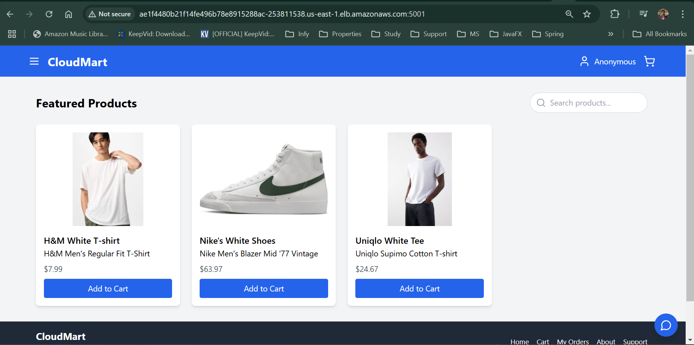
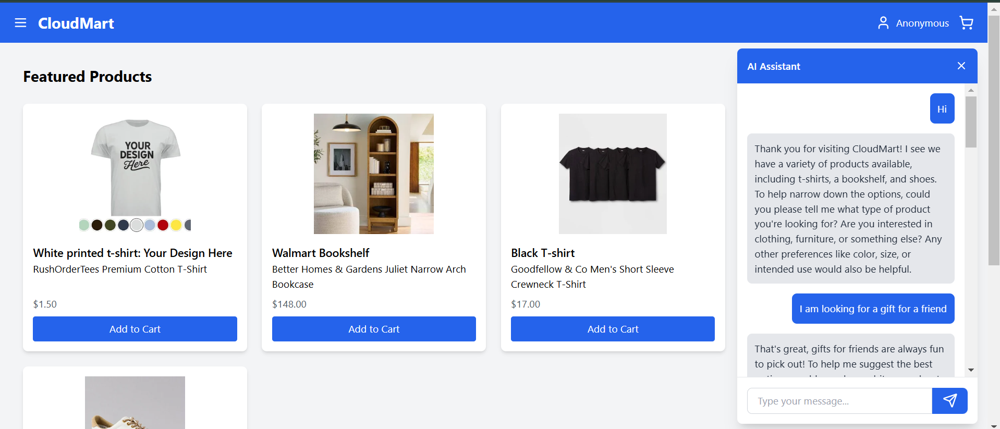
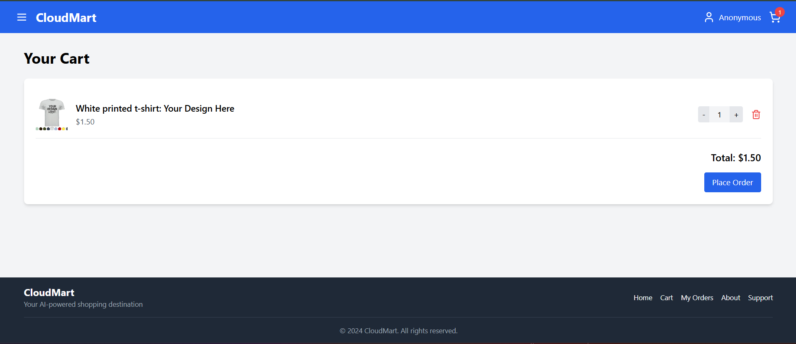
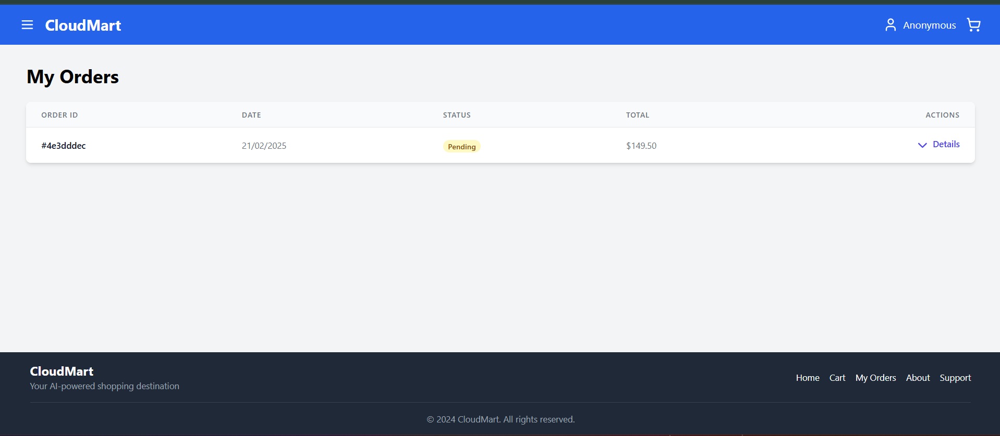
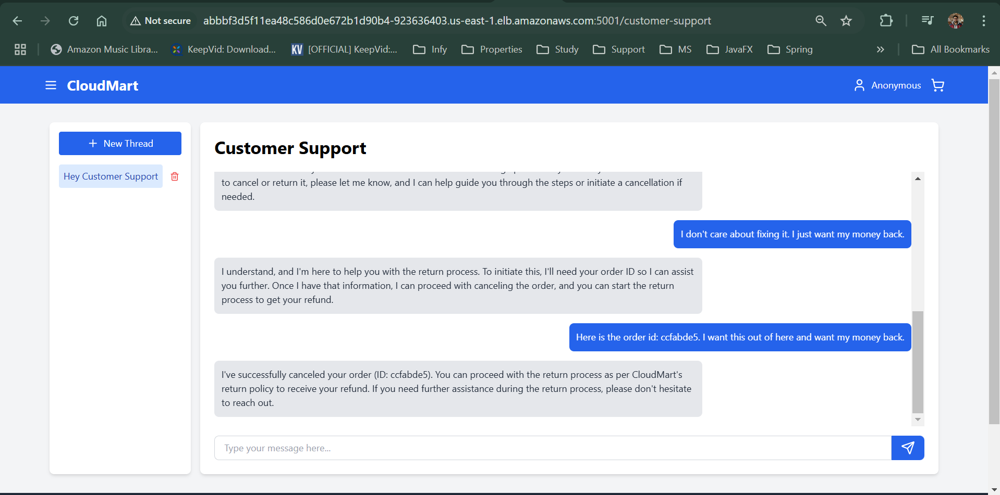
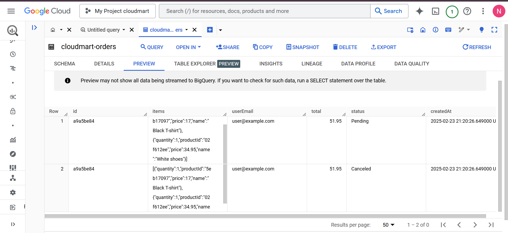
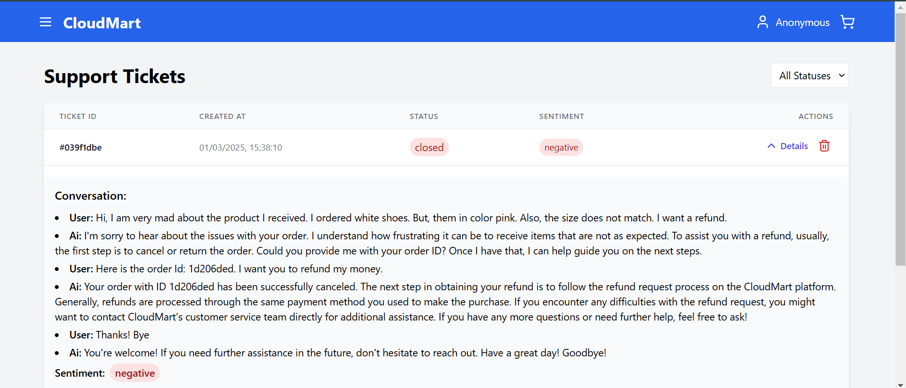
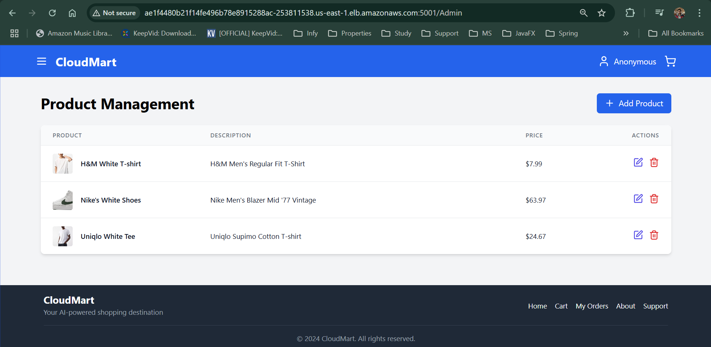

# CloudMart

CloudMart is an innovative e-commerce platform developed as part of an intensive cloud computing and artificial intelligence training program by The Cloud Bootcamp. This project serves as a comprehensive learning experience, combining cutting-edge technologies to create a modern, AI-powered online shopping solution.

## Features

- AI-powered product recommendations
- Cloud-based infrastructure for scalability and reliability
- Real-time inventory management
- Secure payment processing
- Personalized user experiences

## Technologies Used

- Frontend:
  - React
  - Vite
  - Tailwind CSS
- Backend:
  - Node.js
  - Express
- Cloud Services:
  - AWS (Amazon Web Services)
- AI/ML:
  - Machine Learning models for product recommendations
  - Natural Language Processing for customer support chatbot
- Database:
  - DynamoDB
- Data Warehousing/Analytics:
  - Google BigQuery
  - Azure Language - Sentiment Analysis

## Project Structure

```
backend/
├── src/
│   ├── controllers/
│   ├── lambda/
│   ├── routes/
│   ├── services/
│   └── server.js
├── Dockerfile
├── cloudmart-backend.yaml
└── package.json
frontend/
├── public/
├── src/
│   ├── assets/
│   ├── components/
│   ├── config/
│   ├── utils/
│   ├── App.jsx
│   ├── index.css
│   └── main.jsx
├── Dockerfile
├── cloudmart-frontend.yaml
├── eslint.config.js
├── index.html
├── package.json
├── postcss.config.js
├── tailwind.config.js
└── vite.config.js
```


## Getting Started

### Prerequisites

- Node.js (v18.x or later recommended)
- npm (v9.x or later)
- AWS CLI configured with appropriate credentials
- Google Cloud SDK (for BigQuery integration)

### Installation

1. Set up IAM Role and User:

   a. Create another IAM policy, under the same role, with the following policy document and name `CloudMartPolicy`.
      ```
      {
          "Version": "2012-10-17",
          "Statement": [
              {
                  "Effect": "Allow",
                  "Action": [
                      "apigateway:GET",
                      "bedrock:CreateAgent*",
                      "bedrock:CreateFlowVersion",
                      "bedrock:CreateSession",
                      "bedrock:DeleteAgent",
                      "bedrock:DeleteAgentActionGroup",
                      "bedrock:DeleteAgentAlias",
                      "bedrock:DeleteFlowVersion",
                      "bedrock:GetAgent*",
                      "bedrock:List*",
                      "bedrock:PrepareAgent",
                      "cloudformation:CreateStack",
                      "cloudformation:DeleteStack",
                      "cloudformation:DescribeStacks",
                      "cloudformation:ListStacks",
                      "cloudfront:GetDistribution",
                      "dynamodb:*",
                      "ec2:*",
                      "ecr-public:*",
                      "elasticloadbalancing:*",
                      "eks:*",
                      "iam:*",
                      "lambda:AddPermission",
                      "lambda:CreateEventSourceMapping",
                      "lambda:CreateFunction",
                      "lambda:Get*",
                      "lambda:List*",
                      "lambda:Delete*",
                      "lambda:Remove*",
                      "s3:*",
                      "sts:GetCallerIdentity",
                      "sts:GetServiceBearerToken"
                  ],
                  "Resource": "*"
              }
          ]
      }
      ```

      You can give the description as `Policy for Cloudmart Application user.`

   b. Create an IAM User with username: `eksuser` and attach policy: `CloudMartPolicy`.


3. Create an access key for the user, inside user settings.

3. Create an EC2 instance with Amazon Linux AMI (default, for free tier) 64bit. You can name it as `Cloudmart-workstation`.

4. Once you have launched the instance and is ready to use. Connect using SSH or you can open a new connection window using SSM.

5. Setup AWS configuration, using the following command and giving access to `eksuser`, using the access key created earlier.

    ```
    aws configure
    ```

6. Clone the repository.

    ```
    git clone https://github.com/Nikhil-Ads/Cloudmart.git
    ```

7. To use AI Agents, AI assistants and integration with GCP and Azure. You must create those resources on GCP and Azure with the following details.

    * For GCP, go to console and create a new project. Under Big Query, create a new dataset `cloudmart` and create a table in the dataset. Below are the details for the table.

      ```
      [
        {
          "name": "id",
          "mode": "NULLABLE",
          "type": "STRING",
          "description": "",
          "fields": []
        },
        {
          "name": "items",
          "mode": "NULLABLE",
          "type": "JSON",
          "description": "",
          "fields": []
        },
        {
          "name": "userEmail",
          "mode": "NULLABLE",
          "type": "STRING",
          "description": "",
          "fields": []
        },
        {
          "name": "total",
          "mode": "NULLABLE",
          "type": "FLOAT",
          "description": "",
          "fields": []
        },
        {
          "name": "status",
          "mode": "NULLABLE",
          "type": "STRING",
          "description": "",
          "fields": []
        },
        {
          "name": "createdAt",
          "mode": "NULLABLE",
          "type": "TIMESTAMP",
          "description": "",
          "fields": []
        }
      ]
      ```

      Store the credentials for your account and copy them in [google_credentials.json](./backend/src/lambda/addToBigQuery/google_credentials.json) file.

    * For Azure sentiment analysis, use `Language` service in Azure and add create a new language service with name `cloudmart-text-analytics-<unique_id>`. Save the key and endpoint information in clipboard.

    * Also create an OpenAI assistant from [platform.openai.com](https://platform.openai.com/docs/overview) with these [System Instructions](./res/ai_assisstant_system_instructions.txt). You can name it whatever you, a suggestion might be `Cloudmart CS`.

    * Once created, copy the azure key and endpoint, openai api key and assistant id into [cloudmart-backend.yaml](./backend/cloudmart-backend.yaml) file and save.

    * Go to `addToBigQuery` folder, create a new `dynamodb_to_bigquery.zip`, using the following commands.

      ```
      cd backend/src/lambda/addToBigQuery/
      sudo yum install npm
      npm install
      zip -r dynamodb_to_bigquery.zip .
      cd ../../../../
      ```

8. Run `infrastructure_setup.sh`.

    ```
    source ./infrastructure_setup.sh
    ```
    This step will take about 15-20 minutes. So, sit back and relax.

9. The setup file will also create an AWS Bedrock Agent in your AWS account. Copy the Agent ID and Agent Alias ID and update the [cloudmart-backend.yaml](./backend/cloudmart-backend.yaml) file and save.

### Running the Application

1. Go to ECR services and create a new ECR public repository `cloudmart-backend` and then follow the steps in `Push command` to authenticate and push a new backend image. Remember to execute it in the `backend` folder.

  ```
  cd backend
  ```
2. Once done, update the image URI of the newly created image in `cloudmart-backend.yaml`. Update the placeholder `<your-backend-image-URL-from-registry>`<span style="color:yellow">**[IMPORTANT]**</span>.

3. Launch the service in Kubernetes by applying the `cloudmart-backend.yaml` file.

  ```
  kubectl apply -f cloudmart-backend.yaml
  ```

4. Get Kubernetes services to get the LoadBalancer address for the backend and copy the address into clipboard.

  ```
  kubectl get service
  ```

5. Go to frontend folder and update the `.env` file with the address. Remember not to change the port or API being hit. It should look somewhat like <span style="color:yellow">**[IMPORTANT]**</span>.

  To go to `frontend` folder, use the following command:
  ```
  cd ../frontend
  ```

  `.env` file contents:
  ```
  VITE_API_BASE_URL=http://<your-kubernetes-lb-URL-for-backend>:5000/api
  ```

6. Do the same steps as backend to create an ECR repository and pushing an image there for frontend.

7. Once done, update the image URI in `cloudmart-frontend.yaml` at the placeholder, similar to backend at `<your-frontend-image-URL-from-registry>`<span style="color:yellow">**[IMPORTANT]**</span>.

8. Now, launch the Kubernetes service for frontend and get the service loadbalancer address to checkout the application.

  ```
  kubectl apply -f cloudmart-frontend.yaml
  kubectl get pods
  kubectl get nodes
  kubectl get service
  ```

> NOTE: After launching the application, it will take a few seconds for the frontend to be up and running.

9. Hit the Load-Balancer URL for frontend by combining: `http://<EXTERNAL-IP>:<PORT>` to view the application.

## Application API Reference
1. `/` - Home Page of the application to view products on the website. Initially, there would be no products.
2. `/Admin` - Admin Page of the application. You can add products using the UI, as an *Admin*.
3. You can access other pages using the left navigation page and other buttons available on the website.

When you add products they will be become visible on the home page.

## Deployment

The project includes Dockerfiles for both frontend and backend, as well as YAML configuration files for cloud deployment. Refer to the specific cloud provider's documentation for detailed deployment instructions.

## Cleanup

Execute the `infrastructure_cleanup.sh` script for cleaning up resources provisioned by the application.

 ```
 source ./infrastructure_cleanup.sh
 ```

## Application Screenshots

Here are some screenshots of the CloudMart application:

### Main Page

[View Main Page Image](./static/main-page.png)

### AI Product Recommendation

[View Product Listing Image](./static/ai_chatbot_1.png)

### Shopping Cart

[View Shopping Cart Image](./static/cart_1.png)

### Orders Page

[View My Orders Image](./static/my_orders_1.png)

### Customer Support

[View Customer Support Image](./static/CS_1.png)

### Orders Analysis on GCP BigQuery

[View GCP BigQuery Image](./static/BigQuery_Orders_details.png)

### Tickets Sentiment Analysis

[View Sentiment Analysis Image](./static/Sentiment_analysis_1.png)

### Admin Dashboard

[View Admin Dashboard Image](./static/Admin_page.png)

## Contributing

Contributions are welcome! Please feel free to submit a Pull Request.

## Acknowledgements

- The Cloud Bootcamp for providing the training and project opportunity
- All contributors and maintainers of the open-source libraries used in this project

For more information about The Cloud Bootcamp and their programs, visit [www.thecloudbootcamp.com](https://www.thecloudbootcamp.com).